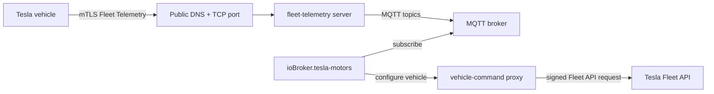

# Fleet Telemetry setup guide

This guide explains how to run Tesla Fleet Telemetry together with the
`ioBroker.tesla-motors` MQTT bridge.

Fleet Telemetry is optional. If you do not enable it, the adapter continues to
work with the normal Fleet API polling mode.

> [!IMPORTANT]
> Fleet Telemetry requires a server that is reachable from the public internet
> and a little bit of Docker/networking knowledge. The adapter does **not** run
> the Tesla Fleet Telemetry server itself. It only consumes the MQTT messages and
> configures the vehicle through the `vehicle-command` proxy.

## What you are building



The important separation is:

- **fleet-telemetry server**: receives live data directly from the car.
- **MQTT broker**: transports decoded telemetry messages to ioBroker.
- **vehicle-command proxy**: signs the Fleet Telemetry configuration request.
- **ioBroker adapter**: subscribes to MQTT and writes values into the existing
  Tesla state tree.

## Before you start

You need:

1. A Tesla Developer application that already works with this adapter.
2. The application public key registered with Tesla.
3. The virtual key paired with the vehicle.
4. A Tesla vehicle with Fleet Telemetry support:
   - firmware `2024.26` or newer for normal Fleet Telemetry support,
   - Model S/X vehicles with Intel Atom computers require newer firmware
     according to Tesla's current Fleet Telemetry documentation.
5. A server or VM/container that can run Docker.
6. A public DNS name, for example `tesla-telemetry.example.com`.
7. A public TCP route from the internet to the Fleet Telemetry server.
8. An MQTT broker reachable from the ioBroker host.

## Important networking note: use TCP passthrough

Tesla vehicles connect to the Fleet Telemetry server with mutual TLS (mTLS).
A normal HTTPS reverse proxy usually terminates TLS and then opens a new TLS
connection to the backend. That breaks the mTLS connection unless the proxy is
configured very specifically.

For a first setup, prefer this:

```text
Internet TCP 443 -> router/firewall/NPM stream/TCP proxy -> fleet-telemetry:443
```

Avoid this for the Fleet Telemetry endpoint:

```text
Internet HTTPS 443 -> normal HTTPS reverse proxy -> fleet-telemetry:443
```

Using Nginx Proxy Manager is fine if you configure a **Stream / TCP host** and
not a normal Proxy Host. The public DNS name in the adapter must resolve from
the internet to that TCP route.

## Example file layout

On the Docker host:

```text
/opt/tesla-telemetry/
├── docker-compose.yml
├── config/
│   └── fleet-telemetry.json
├── certs/
│   ├── telemetry-ca.crt
│   ├── telemetry-server.crt
│   ├── telemetry-server.key
│   ├── proxy-tls-cert.pem
│   └── proxy-tls-key.pem
└── secrets/
    └── fleet-key.pem
```

Never commit `secrets/` or private keys to Git.

## Step 1: prepare certificates

Fleet Telemetry needs a server certificate for the public telemetry hostname.
The car must be able to validate that certificate using the CA PEM that you put
into the adapter settings.

The easiest self-hosted approach is a small private CA for the telemetry server.
Replace `tesla-telemetry.example.com` with your real public hostname:

```sh
mkdir -p /opt/tesla-telemetry/certs /opt/tesla-telemetry/secrets
cd /opt/tesla-telemetry

# Private CA for the telemetry endpoint.
openssl genrsa -out certs/telemetry-ca.key 4096
openssl req -x509 -new -nodes \
  -key certs/telemetry-ca.key \
  -sha256 -days 3650 \
  -out certs/telemetry-ca.crt \
  -subj "/CN=Tesla Fleet Telemetry local CA"

# Server certificate for the public telemetry hostname.
openssl genrsa -out certs/telemetry-server.key 2048
cat > certs/telemetry-server.cnf <<'CERTCONF'
[req]
default_bits = 2048
prompt = no
default_md = sha256
distinguished_name = dn
req_extensions = req_ext

[dn]
CN = tesla-telemetry.example.com

[req_ext]
subjectAltName = @alt_names

[alt_names]
DNS.1 = tesla-telemetry.example.com
CERTCONF

openssl req -new \
  -key certs/telemetry-server.key \
  -out certs/telemetry-server.csr \
  -config certs/telemetry-server.cnf

openssl x509 -req \
  -in certs/telemetry-server.csr \
  -CA certs/telemetry-ca.crt \
  -CAkey certs/telemetry-ca.key \
  -CAcreateserial \
  -out certs/telemetry-server.crt \
  -days 825 -sha256 \
  -extfile certs/telemetry-server.cnf \
  -extensions req_ext
```

The content of `certs/telemetry-ca.crt` is later pasted into the adapter field
**Telemetry server CA / full chain PEM**.

The `vehicle-command` proxy also needs a TLS certificate. For a LAN-only proxy,
a self-signed certificate is usually enough if you enable the adapter option
**Allow insecure vehicle-command proxy TLS**:

```sh
openssl req -x509 -newkey rsa:2048 -nodes \
  -keyout certs/proxy-tls-key.pem \
  -out certs/proxy-tls-cert.pem \
  -days 3650 \
  -subj "/CN=vehicle-command.local"
```

## Step 2: place the Tesla application private key

The `vehicle-command` proxy needs the same private key that belongs to the
registered Tesla application public key.

Save it as:

```text
/opt/tesla-telemetry/secrets/fleet-key.pem
```

Example:

```sh
nano /opt/tesla-telemetry/secrets/fleet-key.pem
chmod 600 /opt/tesla-telemetry/secrets/fleet-key.pem
```

Do not paste this key into issues, logs or screenshots.

## Step 3: create the Fleet Telemetry server config

Create `/opt/tesla-telemetry/config/fleet-telemetry.json`:

```json
{
  "host": "0.0.0.0",
  "port": 443,
  "status_port": 8080,
  "log_level": "info",
  "json_log_enable": false,
  "namespace": "tesla_telemetry",
  "transmit_decoded_records": true,
  "mqtt": {
    "broker": "192.168.1.10:1883",
    "client_id": "fleet-telemetry",
    "topic_base": "tesla-telemetry",
    "qos": 0,
    "retained": false,
    "connect_timeout_ms": 30000,
    "publish_timeout_ms": 2500,
    "keep_alive_seconds": 30
  },
  "records": {
    "V": ["mqtt"],
    "connectivity": ["mqtt"],
    "errors": ["mqtt"],
    "alerts": ["mqtt"]
  },
  "monitoring": {
    "prometheus_metrics_host": "0.0.0.0",
    "prometheus_metrics_port": 9090
  },
  "tls": {
    "server_cert": "/etc/tesla/certs/server/telemetry-server.crt",
    "server_key": "/etc/tesla/certs/server/telemetry-server.key"
  }
}
```

Adjust:

- `mqtt.broker`: your MQTT broker as `host:port`.
- `mqtt.topic_base`: must match the adapter setting. The default is
  `tesla-telemetry`.
- Add `mqtt.username` and `mqtt.password` if your MQTT broker requires login.

`transmit_decoded_records=true` is important because the adapter expects JSON
payloads on MQTT, not protobuf payloads.

## Step 4: create Docker Compose

Create `/opt/tesla-telemetry/docker-compose.yml`:

```yaml
services:
  fleet-telemetry:
    image: tesla/fleet-telemetry:latest
    container_name: fleet-telemetry
    restart: unless-stopped
    command:
      - /fleet-telemetry
      - -config=/etc/fleet-telemetry/config.json
    environment:
      SUPPRESS_TLS_HANDSHAKE_ERROR_LOGGING: "true"
    volumes:
      - ./config/fleet-telemetry.json:/etc/fleet-telemetry/config.json:ro
      - ./certs:/etc/tesla/certs/server:ro
    ports:
      # Public Fleet Telemetry endpoint. Forward your public TCP port to this.
      - "443:443"
      # Optional local status/metrics ports. Do not expose these publicly.
      - "127.0.0.1:8080:8080"
      - "127.0.0.1:9090:9090"

  vehicle-command:
    image: tesla/vehicle-command:latest
    container_name: vehicle-command
    restart: unless-stopped
    command:
      - -tls-key
      - /config/proxy-tls-key.pem
      - -cert
      - /config/proxy-tls-cert.pem
      - -key-file
      - /run/secrets/fleet-key.pem
      - -host
      - 0.0.0.0
      - -port
      - "4443"
    volumes:
      - ./certs:/config:ro
      - ./secrets:/run/secrets:ro
    ports:
      # If ioBroker runs on the same host, keep this on 127.0.0.1.
      # If ioBroker runs on another LAN host, bind this to the LAN IP instead.
      - "127.0.0.1:4443:4443"
```

If your ioBroker host is not the Docker host, change the last line to a LAN-only
binding, for example:

```yaml
      - "192.168.1.20:4443:4443"
```

Do not expose `vehicle-command` to the public internet.

Start the services:

```sh
cd /opt/tesla-telemetry
docker compose up -d
docker compose ps
```

Check logs:

```sh
docker logs --tail 100 fleet-telemetry
docker logs --tail 100 vehicle-command
```

## Step 5: expose the Fleet Telemetry endpoint

Create DNS and routing for your public hostname, for example:

```text
tesla-telemetry.example.com -> your public IP
```

Forward the public TCP port to the Docker host:

```text
public tesla-telemetry.example.com:443 -> docker-host:443
```

If you use Nginx Proxy Manager, use **Streams** / **TCP forwarding**, not a
normal HTTPS Proxy Host.

Then validate the public endpoint from outside your network. Tesla provides a
`check_server_cert.sh` script in the Fleet Telemetry repository. Run it against
the same hostname and port that you will enter in the adapter.

## Step 6: configure the adapter

Open the adapter instance configuration in ioBroker.

### Fleet Telemetry tab

Set:

| Adapter setting | Example | Notes |
| --- | --- | --- |
| Enable Fleet Telemetry mode | enabled | Turns on MQTT ingestion. |
| vehicle-command proxy URL | `https://192.168.1.20:4443` | LAN/internal URL of the proxy. |
| Allow insecure proxy TLS | enabled for self-signed proxy cert | Disable if the proxy cert is trusted. |
| Telemetry server hostname | `tesla-telemetry.example.com` | Public hostname reachable by the car. |
| Telemetry server port | `443` | Must match the public TCP route. |
| Telemetry server CA / full chain PEM | content of `telemetry-ca.crt` | CA that validates the server certificate. |
| MQTT broker | `192.168.1.10:1883` | Broker reachable by ioBroker. |
| MQTT topic base | `tesla-telemetry` | Must match `mqtt.topic_base`. |
| Normal update interval | e.g. `7200` or `0` | Periodic Fleet API sync; `0` disables it. |

### Fleet Telemetry fields tab

Start with the default preset. It is optimized for common charging and vehicle
state use cases.

Useful defaults:

- `Soc`: interval `1`, minimum delta `1` percent.
- `Location`: interval `10`, minimum delta `100 m`.
- Charging/lock/cable fields: short intervals, because they change rarely but
  should be reflected quickly.

Tesla still sends values only when both conditions are true:

1. the configured `interval_seconds` elapsed, and
2. the value changed enough to be emitted.

For numeric fields with `minimum_delta`, smaller changes are suppressed before
they create billable signals.

## Step 7: run the admin actions

Use the buttons in the adapter admin page in this order:

1. **Check Fleet Status**
   - verifies that Tesla reports your vehicle and key status.
2. **Configure Fleet Telemetry**
   - sends the generated configuration to the vehicle through
     `vehicle-command`.
3. **Read Fleet Config**
   - verifies that Tesla reports the config and `synced=true`.

Expected adapter states:

```text
tesla-motors.0.info.telemetryConfigured = true
tesla-motors.0.info.telemetrySynced     = true
tesla-motors.0.info.telemetryConnected  = true
```

## Step 8: verify incoming data

On the MQTT broker, subscribe to the topic base:

```sh
mosquitto_sub -h 192.168.1.10 -p 1883 -t 'tesla-telemetry/#' -v
```

You should see topics like:

```text
tesla-telemetry/<VIN>/connectivity {...}
tesla-telemetry/<VIN>/v/Soc 57.2
tesla-telemetry/<VIN>/v/DetailedChargeState "DetailedChargeStateCharging"
```

In ioBroker, check for updated Tesla states, for example:

```text
tesla-motors.0.<VIN>.charge_state.battery_level
tesla-motors.0.<VIN>.charge_state.charging_state
tesla-motors.0.<VIN>.charge_state.conn_charge_cable
tesla-motors.0.<VIN>.vehicle_state.locked
tesla-motors.0.<VIN>.telemetry.connectivity
```

Unmapped but selected fields are available as raw telemetry states under:

```text
tesla-motors.0.<VIN>.telemetry.fields.<FieldName>
```

## Troubleshooting

| Symptom / error | Likely cause | What to check |
| --- | --- | --- |
| `missing_key` | Virtual key is not paired with the vehicle. | Open `https://tesla.com/_ak/<your-domain>` on a phone with the Tesla app and pair the key. |
| `unsupported_firmware` | Vehicle firmware is too old for Fleet Telemetry. | Update the vehicle firmware and check Tesla's current prerequisites. |
| `streaming_toggle_disabled` | Vehicle reports telemetry streaming disabled. | Check vehicle/Fleet settings and firmware support. |
| `max_configs` | Vehicle already has too many Fleet Telemetry configs. | Remove an unused config from another app or use **Delete Fleet Config** for this app. |
| `telemetrySynced=false` | Tesla accepted the config but the vehicle has not synced it yet. | Wake the car, wait a few minutes, then use **Read Fleet Config** again. |
| MQTT connected but no vehicle data | Vehicle is asleep, config not synced, wrong public route or wrong CA. | Check `fleet-telemetry` logs, run Tesla's cert check script, verify public TCP passthrough. |
| No location fields | OAuth scope `vehicle_location` is missing. | Add the scope in the Tesla Developer app / OAuth flow and reconfigure. |
| TLS handshake errors in logs | Often random internet scanners or wrong proxy mode. | If data still arrives, scanner noise can be ignored; otherwise verify TCP passthrough and certificate chain. |
| Adapter shows `telemetryLastError` | Last MQTT/proxy/config error. | Read the state value and adapter log for details. |

## Safe rollback

If something does not work, disable **Fleet Telemetry mode** in the adapter and
restart the instance. The adapter then falls back to its normal polling behavior.

To remove the vehicle-side telemetry configuration for this application, use the
admin action **Delete Fleet Config**.

## Security checklist

- Do not expose `vehicle-command` publicly.
- Keep `fleet-key.pem` private.
- Prefer firewall rules so only the ioBroker host can reach `vehicle-command`.
- Expose only the Fleet Telemetry mTLS port to the internet.
- Keep Docker images updated.
- Use a dedicated subdomain for Fleet Telemetry.

## References

- Tesla Fleet Telemetry documentation:
  <https://developer.tesla.com/docs/fleet-api/fleet-telemetry>
- Tesla Fleet Telemetry reference server:
  <https://github.com/teslamotors/fleet-telemetry>
- Tesla Fleet Telemetry MQTT datastore:
  <https://github.com/teslamotors/fleet-telemetry/tree/main/datastore/mqtt>
- Tesla vehicle-command proxy:
  <https://github.com/teslamotors/vehicle-command>
